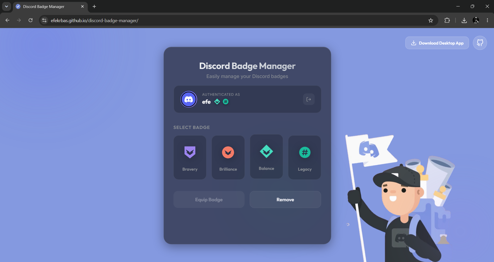
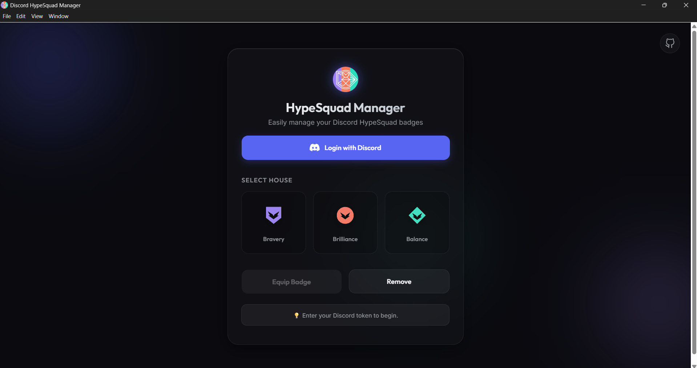

# Discord Badge Manager

A modern, secure application (Web & Desktop) that lets you easily manage your Discord HypeSquad badges without complex manual requests.

## 📝 Notes & Updates

- **Remove Badge Issue:** The "remove badge" feature sometimes doesn't work. I believe this is an issue related to Discord, but if it is related to my code, I will try to fix it.
- **Desktop App Update:** An update for the desktop app is coming soon!

## App Screenshots (Web/Desktop) 

   
  

## ✨ Features

- 🌐 **Web Version**: Use directly in your browser without downloading anything.
- 🖥️ **Desktop Application**: Runs securely on your PC (Windows) with a dedicated Setup Installer or a Portable EXE.
- 🔒 **One-Click Secure Login**: Log in seamlessly via Discord's official login page in the Desktop App without ever handling tokens!
- 👤 **Profile View**: Displays your current Avatar, Username, and HypeSquad Badge.
- ⚡ **Instant Switching**: Switch between Bravery, Brilliance, and Balance instantly.
- 🛡️ **Rate Limit Handling**: Smartly handles Discord's rate limits by telling you exactly when you can switch again.
- 🎨 **Premium UI**: Beautiful, fully responsive glassmorphism design with smooth GSAP animations.

## Badges

| House | Badge | Description |
|:---:|:---:|---|
| **Bravery** |  | Courage and risk-taking |
| **Brilliance** |  | Creativity and innovation |
| **Balance** |  | Harmony and balance |
| **Legacy** |  | Kept original username and #tag before the system change |

## How to Use

You can use this application in two ways: **Web Browser** or **Desktop App**.

### Method 1: Web Browser (No Download Required)
1.  Open the [discord-badge-manager](https://efekrbas.github.io/discord-badge-manager/)
2.  Enter your **Discord Token** in the input field. ([**Watch this video**](https://youtu.be/rcwWex7aqTo) if you don't know how to get token)
3. Select the **HypeSquad Badge** you want (Bravery, Brilliance, or Balance).
4. Click the **"Add Badge"** button.

### Method 2: Desktop Application (Windows) - *Recommended*
With the Desktop app, you don't need to manually find your token! You can simply click **"Login with Discord"**.

1. Go to the **[Latest Release](https://github.com/efekrbas/discord-badge-manager/releases/tag/v1.0.5)** page of this repository.
2. Download **`Discord.HypeSquad.Manager.Setup.1.0.5.exe`** to install the app on your PC.
3. Launch the application and click **Login with Discord**.

## ⚠️ Disclaimer

- **Never share your token** with anyone.
- Use this tool responsibly and in accordance with Discord's Terms of Service.

## 📄 License

MIT

